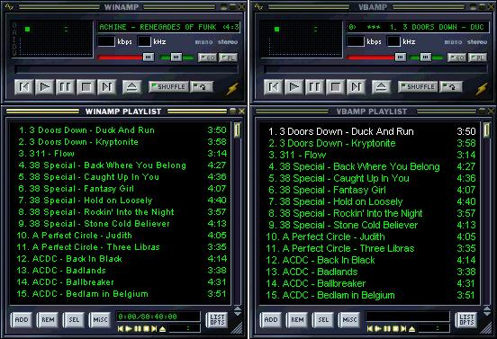



## VBAmp 1\.1 \(Winamp Clone\)

### Description

This is a Winamp clone (Updated 11/7/01) and it is very far from being finished but I thought that I should let everyone see my progress. Completely changed the playlist from being based around labels to being based around picture boxes (so I could use the keydown functions). Right now it only has a few features that Winamp has, and in the end I hope to have all the features Winamp has and some. It supports skins for Winamp, but only in folder form, and it has pretty much all the basic features needed to play MP3's. It can load and save M3U's.
 
### More Info
 

             |
---                |---
**Submitted On**   |2001-11-06 10:18:06
**By**             |[Ryan Chandler](https://github.com/Planet-Source-Code/PSCIndex/blob/master/ByAuthor/ryan-chandler.md)
**Level**          |Intermediate
**User Rating**    |4.8 (24 globes from 5 users)
**Compatibility**  |VB 6\.0
**Category**       |[Sound/MP3](https://github.com/Planet-Source-Code/PSCIndex/blob/master/ByCategory/sound-mp3__1-45.md)
**World**          |[Visual Basic](https://github.com/Planet-Source-Code/PSCIndex/blob/master/ByWorld/visual-basic.md)
**Archive File**   |[VBAmp\_1\_1\_338831172001\.zip](https://github.com/Planet-Source-Code/ryan-chandler-vbamp-1-1-winamp-clone__1-24851/archive/master.zip)

